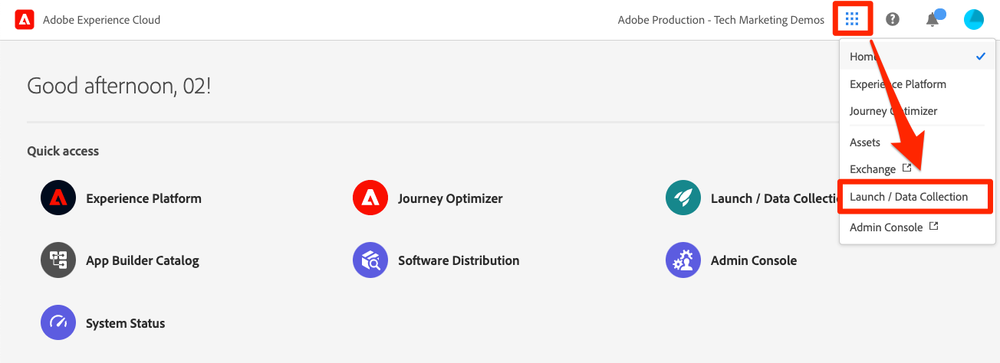
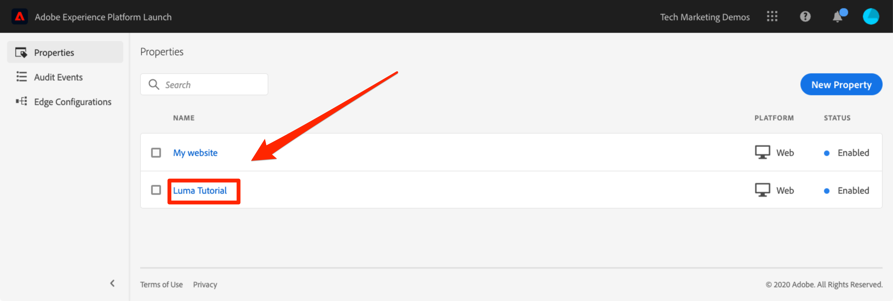

# Creare una proprietà tag

In questa lezione verrà creata la prima proprietà tag.

Una proprietà è fondamentalmente un contenitore che riempi con estensioni, regole, elementi dati e librerie durante la distribuzione di tag sul sito.

## Prerequisiti

Per completare le lezioni successive, devi disporre delle autorizzazioni per sviluppare, approvare, pubblicare, gestire le estensioni e gli ambienti nei tag. Se non riesci a completare nessuna di queste operazioni perché le opzioni dell’interfaccia utente non sono disponibili, rivolgiti al tuo amministratore Experience Cloud per richiedere l’accesso. Per ulteriori informazioni sulle autorizzazioni per gli utenti dei tag, consulta [la documentazione](https://experienceleague.adobe.com/docs/experience-platform/tags/admin/user-permissions.html).

>[!NOTE]
>
>Adobe Experience Platform Launch viene integrato in Adobe Experience Platform come suite di tecnologie per la raccolta dati. Nell’interfaccia sono state introdotte diverse modifiche terminologiche di cui tenere conto durante l’utilizzo di questo contenuto:
>
> * Il platform launch (lato client) è ora **[[!DNL tags]](https://experienceleague.adobe.com/docs/experience-platform/tags/home.html?lang=it)**
> * Lato server di platform launch è ora **[[!DNL event forwarding]](https://experienceleague.adobe.com/docs/experience-platform/tags/event-forwarding/overview.html)**
> * Le configurazioni Edge sono ora **[[!DNL datastreams]](https://experienceleague.adobe.com/docs/experience-platform/edge/fundamentals/datastreams.html?lang=it)**

## Finalità di apprendimento

Alla fine di questa lezione, potrai:

* Accedere all’interfaccia utente di Raccolta dati
* Creare una nuova proprietà tag
* Configurare una proprietà tag

## Passa all’interfaccia di raccolta dati

**Per passare alla raccolta dati**

1. Accedi ad [Adobe Experience Cloud](https://experiencecloud.adobe.com).

1. Fai clic sul pulsante  icona per aprire il commutatore dell’app

1. Seleziona **[!UICONTROL Launch/Raccolta dati]** dal menu 

Ora dovresti visualizzare la `Tags Properties` schermata (se non sono state create proprietà nell’account, questa schermata potrebbe essere vuota):

## Creare una proprietà

Una proprietà è fondamentalmente un contenitore che riempi con estensioni, regole, elementi dati e librerie durante la distribuzione di tag sul sito. Una proprietà può essere un raggruppamento di uno o più domini e sottodomini. Puoi gestire e tenere traccia di queste risorse in modo simile. Ad esempio, supponi di disporre di più siti Web basati su un modello e di voler tenere traccia delle stesse risorse su tutti. Puoi applicare una proprietà a più domini. Per ulteriori informazioni sulla creazione di proprietà, consulta [&quot;Aziende e proprietà&quot;](https://experienceleague.adobe.com/docs/experience-platform/tags/admin/companies-and-properties.html) nella documentazione del prodotto.

**Creare una proprietà**

1. Fai clic sul pulsante **[!UICONTROL Nuova proprietà]**:

   

1. Denomina la proprietà (ad esempio `Luma Tutorial` o `Luma Tutorial - Daniel`)
1. Come dominio, immetti `enablementadobe.com` poiché è il dominio in cui è ospitato il sito dimostrativo Luma. Anche se il campo &quot;Dominio&quot; è obbligatorio, la proprietà tag funzionerà su qualsiasi dominio in cui è implementato. Lo scopo principale di questo campo è precompilare le opzioni di menu nel Generatore di regole.
1. Espandi la **[!UICONTROL Opzioni avanzate]** e seleziona la casella per **[!UICONTROL Eseguire componenti regola in sequenza]**
1. Fai clic sul pulsante **[!UICONTROL Salva]**.

   

La nuova proprietà deve essere visualizzata sulla pagina Proprietà. Tieni presente che se selezioni la casella accanto al nome della proprietà, le opzioni per **[!UICONTROL configurare]** o **[!UICONTROL eliminare]** la proprietà vengono visualizzate sopra l’elenco delle proprietà. Fai clic sul nome della proprietà (ad es. `Luma Tutorial`) per aprire la schermata `Overview`.

[Successivo “Aggiungere il codice di incorporamento ](add-embed-code.md)
