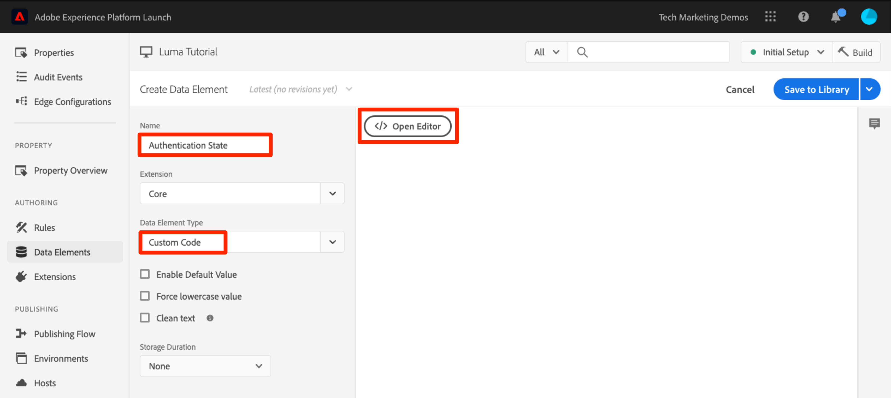
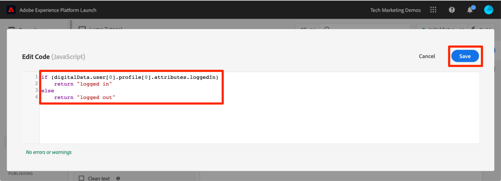
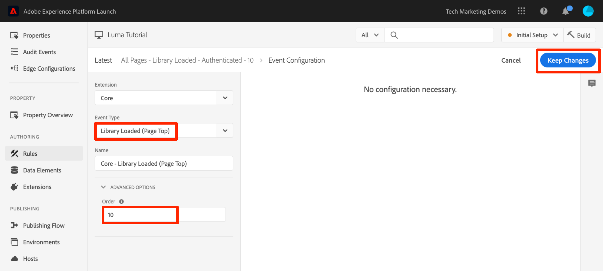

# Aggiungere Adobe Experience Platform Identity Service

Questa lezione illustra i passaggi necessari per implementare l’estensione [Adobe Experience Platform Identity Service](https://experienceleague.adobe.com/docs/experience-platform/tags/extensions/adobe/id-service/overview.html?lang=it) e inviare gli ID cliente.

Il servizio [Adobe Experience Platform Identity](https://experienceleague.adobe.com/docs/id-service/using/home.html?lang=it) imposta un ID visitatore comune in tutte le soluzioni Adobe per abilitare le funzionalità di Experience Cloud, ad esempio la condivisione del pubblico tra le soluzioni. Puoi anche inviare i tuoi ID cliente personalizzati al servizio per abilitare il targeting su più dispositivi e le integrazioni con il tuo sistema di gestione delle relazioni con i clienti (CRM).

>[!NOTE]
>
>Adobe Experience Platform Launch viene integrato in Adobe Experience Platform come suite di tecnologie per la raccolta dati. Nell’interfaccia sono state introdotte diverse modifiche terminologiche di cui tenere conto quando si utilizza questo contenuto:
>
> * Il platform launch (lato client) è ora **[[!DNL tags]](https://experienceleague.adobe.com/docs/experience-platform/tags/home.html?lang=it)**
> * Platform Launch Server Side è ora **[[!DNL event forwarding]](https://experienceleague.adobe.com/docs/experience-platform/tags/event-forwarding/overview.html?lang=it)**
> * Le configurazioni di Edge sono ora **[[!DNL datastreams]](https://experienceleague.adobe.com/docs/experience-platform/edge/fundamentals/datastreams.html?lang=it)**

## Finalità di apprendimento

Alla fine di questa lezione, potrai:

* Aggiungere l’estensione Identity Service
* Creare un elemento dati per raccogliere gli ID cliente
* Creare una regola che utilizza l’azione Imposta ID cliente per inviare gli ID cliente ad Adobe
* Utilizzare la funzione di ordinamento delle regole per mettere in sequenza le regole che si attivano nello stesso evento

## Prerequisiti

Dovresti aver già completato le lezioni nella sezione [Configurare i tag](create-a-property.md).

## Aggiungere l’estensione Identity Service

Dato che questa è la prima estensione che stai aggiungendo, ecco una breve panoramica sulle estensioni. Le estensioni sono una delle funzionalità principali dei tag. Un’estensione è un’integrazione generata da Adobe, un partner Adobe o qualsiasi cliente Adobe, che aggiunge opzioni nuove e infinite per i tag e che puoi distribuire sul tuo sito web. Se pensi ai tag come a un sistema operativo, le estensioni sono le app installate in modo che i tag possano eseguire le operazioni che desideri.

**Per aggiungere l’estensione Identity Service**

1. Nel menu di navigazione a sinistra, fai clic su **[!UICONTROL Estensioni]**

1. Fai clic su **[!UICONTROL Catalogo]** per passare alla pagina Catalogo estensioni

1. Osserva la varietà di estensioni disponibili nel Catalogo

1. Nel filtro della parte superiore della pagina, digita “ID” per filtrare il Catalogo

1. Nella scheda del servizio Adobe Experience Platform Identity, fai clic su **[!UICONTROL Installa]**

   

1. Tieni presente che l’ID organizzazione Experience Cloud è stato rilevato automaticamente

1. Lascia tutte le impostazioni predefinite e fai clic su **[!UICONTROL Salva nella libreria e genera]**

   

>[!NOTE]
>
>Ogni versione dell’estensione del servizio Identity include una versione specifica di VisitorAPI.js indicata nella descrizione dell’estensione. Aggiorna la versione VisitorAPI.js aggiornando l’estensione Identity Service.

### Convalidare l’estensione

L’estensione del servizio Identity è una delle poche estensioni tag che effettuano una richiesta senza dover utilizzare un’azione delle regole. L’estensione invia automaticamente una richiesta a Identity Service al primo caricamento della pagina nella prima visita a un sito web. Quando l’ID è stato richiesto, viene memorizzato in un cookie di prima parte, il cui nome inizia con_“AMCV_”.

**Per convalidare l’estensione Identity Service**

1. Apri il [sito Luma](https://luma.enablementadobe.com/content/luma/us/en.html).

1. Accertati che Debugger mappi la proprietà tag nell&#39;ambiente di sviluppo *your*, come descritto nella [lezione precedente](switch-environments.md).

1. Nella scheda Riepilogo del debugger, la sezione dei tag deve indicare che l’estensione del servizio Adobe Experience Platform Identity è implementata.

1. Inoltre, nella scheda Riepilogo, la sezione del servizio Identity deve essere compilata con lo stesso ID organizzazione visualizzato nella schermata di configurazione dell’estensione nell’interfaccia di Data Collection:

   

1. Nella scheda Identity Service del debugger potrebbe essere visualizzata la richiesta iniziale di recupero dell’ID visitatore. Questo, tuttavia, potrebbe essere già stato richiesto, per cui non preoccuparti se non la vedi:
   

1. Dopo la richiesta iniziale di recupero dell&#39;ID visitatore, l&#39;ID viene memorizzato in un cookie il cui nome inizia con `AMCV_`. Puoi confermare che il cookie è stato impostato seguendo questa procedura:
   1. Apri gli Strumenti per sviluppatori del browser
   1. Passa alla scheda `Application`.
   1. Espandi la voce `Cookies` a sinistra
   1. Fai clic sul dominio `https://luma.enablementadobe.com`
   1. Cerca il cookie AMCV_ sul lato destro. Potresti visualizzarne diversi poiché il sito Luma è stato caricato utilizzando sia la sua proprietà di tag di codifica fissa, sia quella mappata sulla tua.

      

Tutto qui. Hai aggiunto la tua prima estensione! Per ulteriori informazioni sulle opzioni di configurazione di Identity Service, consulta [la documentazione](https://experienceleague.adobe.com/docs/id-service/using/id-service-api/configurations/function-vars.html?lang=it).

## Inviare ID cliente

Successivamente, invierai un [ID cliente](https://experienceleague.adobe.com/docs/id-service/using/reference/authenticated-state.html?lang=it) a Identity Service. Questo ti consente di [integrare il CRM](https://experienceleague.adobe.com/docs/core-services/interface/customer-attributes/attributes.html?lang=it) con Experience Cloud, nonché di tenere traccia dei visitatori tra i dispositivi.

Nella lezione precedente, [Aggiungere elementi dati, regole e librerie](add-data-elements-rules.md) hai creato un elemento dati e lo hai utilizzato in una regola. Ora, utilizzerai le stesse tecniche per inviare un ID cliente quando il visitatore è autenticato.

### Creare elementi di dati per gli ID cliente

Inizia creando due elementi di dati:

1. `Authentication State`: per stabilire se il visitatore ha eseguito o meno l’accesso
1. `Email (Hashed)`: per acquisire la versione con hash dell’indirizzo e-mail (utilizzato come ID cliente) dal livello dati

**Creare l’elemento dati per Authentication State**

1. Fai clic su **[!UICONTROL Elementi dati]** nel menu di navigazione a sinistra
1. Fai clic sul pulsante **[!UICONTROL Aggiungi elemento dati]**

   

1. Denomina l’elemento dati `Authentication State`
1. Per **[!UICONTROL Tipo elemento dati]**, selezionare **[!UICONTROL Codice personalizzato]**
1. Fai clic sul pulsante **[!UICONTROL Apri editor]**

   

1. Nella finestra [!UICONTROL Modifica codice], utilizza il seguente codice per restituire i valori di “connesso” o “disconnesso” in base a un attributo nel livello dati del sito Luma:

   ```javascript
   if (digitalData.user[0].profile[0].attributes.loggedIn)
       return "logged in"
   else
       return "logged out"
   ```

1. Fai clic su **[!UICONTROL Salva]** per salvare il codice personalizzato

   

1. Lascia i valori predefiniti per tutte le altre impostazioni
1. Fai clic su **[!UICONTROL Salva nella libreria]** per salvare l&#39;elemento dati e tornare alla pagina degli elementi dati. Non sarà necessario eseguire una &quot;build&quot; finché non verranno apportate tutte le modifiche e non si sarà pronti per la convalida.

   

Conoscendo lo stato di autenticazione dell’utente, sai quando deve esistere nella pagina un ID cliente da inviare a Identity Service. Il passaggio successivo consiste nel creare un elemento dati per l’ID cliente stesso. Nel sito di dimostrazione Luma utilizzerai la versione con hash dell’indirizzo e-mail del visitatore.

**Aggiungere l’elemento dati per l’e-mail con hash**

1. Fai clic sul pulsante **[!UICONTROL Aggiungi elemento dati]**

   

1. Denomina l’elemento dati `Email (Hashed)`
1. Per **[!UICONTROL Tipo elemento dati]**, selezionare **[!UICONTROL Variabile JavaScript]**
1. Come **[!UICONTROL nome variabile JavaScript]**, usa il puntatore seguente su una variabile nel livello dati del sito Luma: `digitalData.user.0.profile.0.attributes.username`
1. Lascia i valori predefiniti per tutte le altre impostazioni
1. Fai clic su **[!UICONTROL Salva nella libreria]** per salvare l&#39;elemento dati

   

### Aggiungere una regola per inviare gli ID cliente

Adobe Experience Platform Identity Service trasmette gli ID cliente nelle regole utilizzando un’azione denominata “Imposta ID cliente”. Ora creerai una regola per attivare questa azione quando il visitatore viene autenticato.

**Creare una regola per inviare gli ID cliente**

1. Nel menu di navigazione a sinistra, fai clic su **[!UICONTROL Regole]**
1. Fai clic su **[!UICONTROL Aggiungi regola]** per aprire il Generatore di regole

   

1. Denomina la regola `All Pages - Library Loaded - Authenticated - 10`

   >[!TIP]
   >
   >Questa convenzione per i nomi indica che stai attivando questa regola nella parte superiore di tutte le pagine quando l’utente è autenticato e avrà un ordine di &quot;10&quot;. L’utilizzo di una convenzione per i nomi come questa, invece di usare una denominazione per le soluzioni attivate nelle azioni, consentirà di ridurre al minimo il numero complessivo di regole necessarie per l’implementazione.

1. In **[!UICONTROL Eventi]** fare clic su **[!UICONTROL Aggiungi]**

   

   1. Per **[!UICONTROL Tipo evento]** seleziona **[!UICONTROL Libreria caricata (parte superiore pagina)]**
   1. Espandi la sezione **[!UICONTROL Opzioni avanzate]** e per **[!UICONTROL Ordine]** immetti `10`. L’ordine controlla la sequenza di regole attivate dallo stesso evento. Le regole con un ordine inferiore si attiveranno prima delle regole con un ordine più elevato. In questo caso, imposta l’ID cliente prima di attivare la richiesta Target, operazione che eseguirai nella prossima lezione con una regola con ordine di `50` .
   1. Fai clic sul pulsante **[!UICONTROL Mantieni modifiche]** per tornare al Generatore di regole

   

1. In **[!UICONTROL Condizioni]** fare clic su **[!UICONTROL Aggiungi]**

   

   1. Per **[!UICONTROL Tipo condizione]** selezionare **[!UICONTROL Confronto valori]**
   1. Fai clic sull’icona  per aprire l’elemento dati modale

      

   1. Nel modale Elemento dati, fai clic su **[!UICONTROL Stato autenticazione]**, quindi su **[!UICONTROL Seleziona]**

      

1. Assicurati che l’operatore sia `Equals`
1. Digita “logged in” nel campo di testo. Questo causa l’attivazione della regola ogni volta che l’elemento di dati “Stato autenticazione” ha un valore di “logged in”

1. Fai clic su **[!UICONTROL Mantieni modifiche]**

   

1. In **[!UICONTROL Azioni]** fare clic su **[!UICONTROL Aggiungi]**

   

   1. Per **[!UICONTROL Extension]** seleziona **[!UICONTROL Experience Cloud ID Service]**
   1. Per **[!UICONTROL Tipo azione]** seleziona **[!UICONTROL Imposta ID cliente]**
   1. Per **[!UICONTROL Codice integrazione]** immettere `crm_id`
   1. Per **[!UICONTROL Valore]**, apri il selettore modale Elemento dati e seleziona `Email (Hashed)`
   1. Per **[!UICONTROL Stato autenticazione]** selezionare **[!UICONTROL Autenticato]**
   1. Fai clic sul pulsante **[!UICONTROL Mantieni modifiche]** per salvare l&#39;azione e tornare al Generatore di regole

      

1. Fai clic sul pulsante **[!UICONTROL Salva nella libreria e genera]** per salvare la regola

   

Ora hai creato una regola che invierà l’ID cliente come variabile `crm_id` quando il visitatore viene Autenticato. Poiché hai specificato `10` come Ordine, questa regola verrà attivata prima della regola `All Pages - Library Loaded` creata nella lezione [Aggiungere elementi dati, regole e librerie](add-data-elements-rules.md), che utilizza `50` come valore predefinito dell’Ordine.

### Convalidare gli ID cliente

Per convalidare il lavoro, dovrai accedere al sito Luma per confermare il comportamento della nuova regola.

**Per accedere al sito Luma**

1. Apri il [sito Luma](https://luma.enablementadobe.com/content/luma/us/en.html).

1. Accertati che Debugger mappi la proprietà tag nell&#39;ambiente di sviluppo *your*, come descritto nella [lezione precedente](switch-environments.md)

   

1. Fai clic sul collegamento **[!UICONTROL ACCESSO]** nell&#39;angolo superiore destro del sito Luma

   

1. Immetti `test@adobe.com` come nome utente
1. Immetti `test` come password
1. Fai clic sul pulsante **[!UICONTROL ACCESSO]**

   

1. Torna alla pagina principale

Ora, conferma l’invio dell’ID cliente al Servizio utilizzando l’estensione Debugger.

**Per verificare che Identity Service stia passando l’ID cliente**

1. Assicurati che la scheda con il sito Luma sia visibile
1. Nel debugger, vai alla scheda di Adobe Experience Platform Identity Service
1. Espandi il tuo ID organizzazione
1. Fai clic sulla cella con il valore `Customer ID - crm_id`
1. Nel modale, noterai il valore dell’ID cliente con lo stato `AUTHENTICATED`:

   

1. Tieni presente che puoi confermare il valore dell’e-mail con hash visualizzando il codice sorgente della pagina Luma e controllando la proprietà del nome utente. Questa deve corrispondere al valore visualizzato nel debugger:

   

### Suggerimenti aggiuntivi per la convalida

I tag dispongono anche di funzioni avanzate di registrazione della console. Per attivarli, vai alla scheda **[!UICONTROL Strumenti]** nel debugger e attiva l&#39;opzione **[!UICONTROL Registrazione console tag]**.


In questo modo attiverai la registrazione della console sia nella console del browser che nella scheda Registri del debugger. Dovresti visualizzare la registrazione di tutte le regole create finora! Tieni presente che le nuove voci di registro si aggiungono nella parte superiore dell’elenco, pertanto la regola “All Pages - Library Loaded - Authenticated - 10” deve essere attivata prima della regola “All Pages - Library Loaded” e apparire sotto di essa nei registri della console di Debugger:


[Avanti &quot;Aggiungere Adobe Target&quot; >](target.md)
