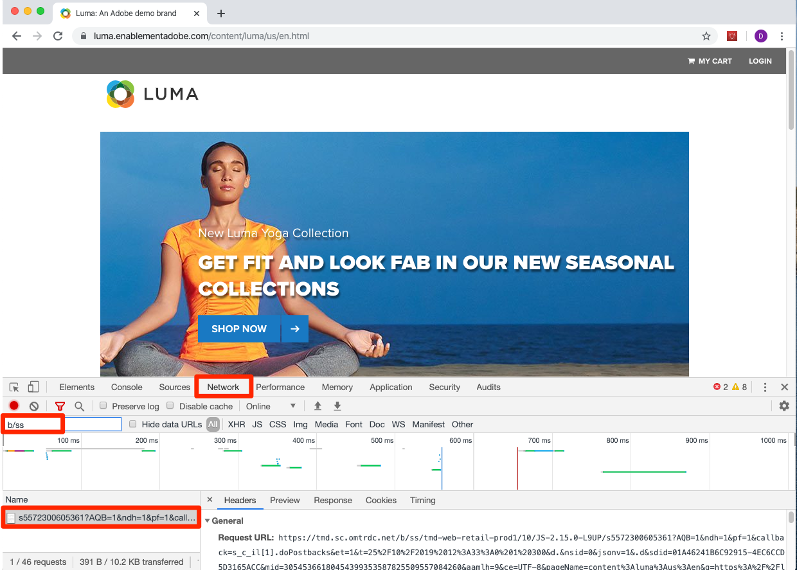

# Integrazioni di Experience Cloud

In questa lezione, verranno esaminate le integrazioni chiave tra le soluzioni appena implementate. La buona notizia è che completando le lezioni precedenti, hai già implementato gli aspetti del codice delle integrazioni! Questa esercitazione non consisterà in nessuna operazione aggiuntiva, se non di lettura e conferma.

>[!WARNING]
>
> Il sito web Luma utilizzato in questa esercitazione dovrebbe essere sostituito durante la settimana del 16 febbraio 2026. Il lavoro svolto come parte di questo tutorial potrebbe non essere applicabile al nuovo sito web.

## Finalità di apprendimento

Alla fine di questa lezione, potrai:

1. Spiega i casi d’uso di base per Condivisione del pubblico, Analytics for Target (A4T) e Attributi del cliente
1. Convalidare gli aspetti dell&#39;implementazione di base lato client di queste integrazioni

## Prerequisiti

Prima di seguire le istruzioni fornite in questa lezione, è necessario completare tutte le lezioni precedenti.

>[!NOTE]
>
>Esistono molti requisiti di autorizzazioni utente, configurazioni account e passaggi di provisioning necessari per utilizzare completamente queste integrazioni e che vanno oltre l’ambito di questa esercitazione. Se non utilizzi già queste integrazioni nell’implementazione corrente di Experience Cloud, prendi in considerazione quanto segue:
>
>* Verifica tutti i requisiti delle [integrazioni dei Servizi Core](https://experienceleague.adobe.com/it/docs/core-services/interface/services/getting-started)
>* Verifica i requisiti completi dell&#39;[integrazione di Analytics for Target](https://experienceleague.adobe.com/it/docs/target/using/integrate/a4t/before-implement)

## Tipi di pubblico

[Audiences](https://experienceleague.adobe.com/it/docs/core-services/interface/services/audiences/overview) fa parte del servizio core Persone e consente di condividere i tipi di pubblico tra le soluzioni. Ad esempio, puoi creare un tipo di pubblico in Audience Manager e utilizzarlo per distribuire contenuti personalizzati con Target.

I requisiti principali per implementare A4T, operazione che hai già eseguito, sono i seguenti:

1. Implementare Adobe Experience Platform Identity Service
1. Implementare Audience Manager
1. Implementare altre soluzioni per ricevere o creare tipi di pubblico, ad esempio Target e Analytics

### Convalidare l’integrazione di Tipi di pubblico

Il modo migliore per convalidare l’integrazione di Audiences è quello di creare effettivamente un tipo di pubblico, condividerlo con un’altra soluzione e quindi utilizzarlo completamente nell’altra soluzione (ad esempio, verificare che un visitatore idoneo per un segmento AAM possa qualificarsi per un’attività Target mirata a quel segmento). Tuttavia, questo va oltre l’ambito dell’esercitazione.

Questi passaggi di convalida si concentreranno sulla parte critica visibile nell’implementazione lato client: l’ID visitatore.

1. Apri il [sito Luma](https://luma.enablementadobe.com/content/luma/us/en.html).

1. Accertati che Debugger mappi la proprietà tag nell&#39;ambiente di sviluppo *your*, come descritto nella [lezione precedente](switch-environments.md)

   

1. Vai alla scheda Rete del debugger

1. Fai clic su **[!UICONTROL Cancella tutte le richieste]** per liberare spazio

1. Ricarica la pagina Luma, assicurandoti di visualizzare le richieste Target e Analytics nel debugger

1. Ricarica nuovamente la pagina Luma

1. Ora dovresti vedere quattro richieste nella scheda Rete del debugger: due per Target e due per Analytics

1. Cerca nella riga con l’etichetta &quot;ID visitatore Experience Cloud&quot;. Gli ID in tutte le richieste di ogni soluzione devono essere sempre gli stessi.

   

1. Gli ID sono univoci per visitatore. Puoi confermarli chiedendo a un collega di ripetere questi passaggi.

## Analytics for Target (A4T)

L’integrazione [Analytics for Target (A4T)](https://experienceleague.adobe.com/docs/target/using/integrate/a4t/a4t.html?lang=it) ti consente di sfruttare i dati di Analytics come origine per le metriche di reporting in Target.

I requisiti principali per implementare A4T, operazione che hai già eseguito, sono i seguenti:

1. Implementare Adobe Experience Platform Identity Service
1. Attiva la richiesta di caricamento pagina di Target prima del beacon di visualizzazione della pagina di Analytics

A4T funziona combinando una richiesta lato server da Target ad Analytics con il beacon di visualizzazione della pagina di Analytics, che chiamiamo &quot;hit-stitching&quot;. Il processo di hit-stitching richiede che la richiesta Target che distribuisce l’attività (o che incrementa una metrica di obiettivo basata su Target) includa un parametro che corrisponda a un parametro nel beacon di visualizzazione della pagina di Analytics. Questo parametro è denominato ID dati supplementare (SDID).

### Convalidare l’implementazione di A4T

Il modo migliore per convalidare l’integrazione A4T consiste nel creare effettivamente un’attività Target utilizzando A4T e convalidare i dati di reporting, tuttavia questo va oltre l’ambito di questa esercitazione. Questa esercitazione ti mostrerà come confermare che gli ID dati supplementari corrispondano tra le chiamate della soluzione.

**Convalidare gli SDID**

1. Apri il [sito Luma](https://luma.enablementadobe.com/content/luma/us/en.html).

1. Accertati che Debugger mappi la proprietà tag nell&#39;ambiente di sviluppo *your*, come descritto nella [lezione precedente](switch-environments.md)

   

1. Vai alla scheda Rete del debugger

1. Fai clic su **[!UICONTROL Cancella tutte le richieste]** per liberare spazio

1. Ricarica la pagina Luma, assicurandoti di visualizzare le richieste Target e Analytics nel debugger

1. Ricarica nuovamente la pagina Luma

1. Ora dovresti vedere quattro richieste nella scheda Rete del debugger: due per Target e due per Analytics

1. Osserva la riga &quot;ID dati supplementari&quot;. Gli ID dal primo caricamento della pagina devono corrispondere tra Target e Analytics. Anche gli ID del secondo caricamento della pagina devono corrispondere, ma sono diversi da quelli del primo caricamento.

   

Se esegui richieste aggiuntive di Target nell’ambito di un caricamento di pagina (escluse le app a pagina singola) che fanno parte di attività di A4T, è opportuno assegnare loro nomi univoci (non target-global-mbox) in modo che continuino ad avere gli stessi SDID delle richieste di Target e Analytics iniziali.

## Attributi cliente

[Attributi cliente](https://experienceleague.adobe.com/docs/core-services/interface/customer-attributes/attributes.html?lang=it) fa parte del servizio core Persone, il quale ti consente di caricare dati dal database di gestione delle relazioni con i clienti (Customer Relationship Management, CRM) e di sfruttarli in Adobe Analytics e Adobe Target.

I requisiti principali per implementare gli attributi del cliente, operazione che hai già eseguito, sono i seguenti:

1. Implementare Adobe Experience Platform Identity Service
1. Impostare gli ID cliente tramite il servizio ID *prima* che Target e Analytics attivino le loro richieste (che può essere realizzato utilizzando la funzione di ordinamento delle regole nei tag)

### Convalidare l’implementazione di Attributi cliente

Hai già verificato che gli ID cliente vengano passati sia a Identity Service che a Target nelle lezioni precedenti. Puoi anche convalidare l’ID cliente nell’hit di Analytics. 
Al momento, l’ID cliente è uno dei pochi parametri che non vengono visualizzati nel debugger di Experience Cloud, ma puoi utilizzare la console JavaScript del browser per visualizzarlo.

1. Apri il sito Luma.
1. Apri gli Strumenti per sviluppatori del browser
1. Passa alla scheda Rete
1. Nel campo del filtro, digita `b/ss` che limiterà il contenuto visualizzato alle richieste di Adobe Analytics

   

1. Fai clic sul collegamento **[!UICONTROL ACCESSO]** nell&#39;angolo superiore destro del sito

   

1. Immetti `test@test.com` come nome utente
1. Immetti `test` come password
1. Fai clic sul pulsante **[!UICONTROL ACCESSO]**

   

1. Verrai reindirizzato alla home page, che attiverà anche un beacon visibile negli strumenti per sviluppatori. Se vieni reindirizzato alla pagina delle informazioni sull’account, fai clic sul logo WE.RETAIL per tornare alla home page.
1. Fai clic sulla richiesta e seleziona la scheda Intestazioni
1. Scorri verso il basso fino a visualizzare alcuni parametri nidificati
   1. cid: delimitatore standard per la porzione ID cliente della richiesta
   1. crm_id: è il codice di integrazione personalizzato, specificato nella lezione su Identity Service
   1. id: il valore ID cliente proviene dall’elemento dati `Email (Hashed)`
   1. as: lo stato di autenticazione, con &quot;1&quot; che significa &quot;accesso eseguito&quot;

   

[Avanti &quot;Pubblicare la proprietà&quot; >](publish.md)
