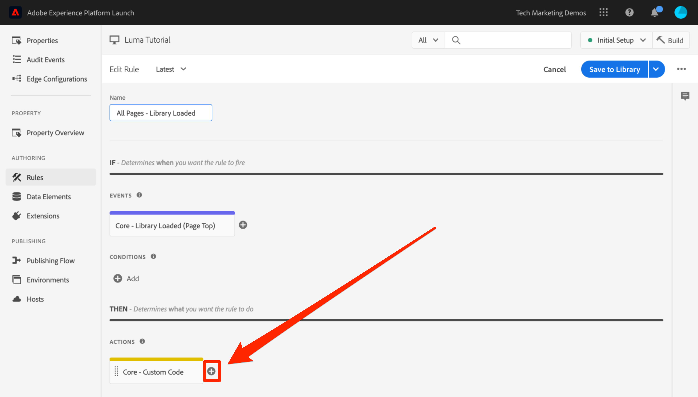
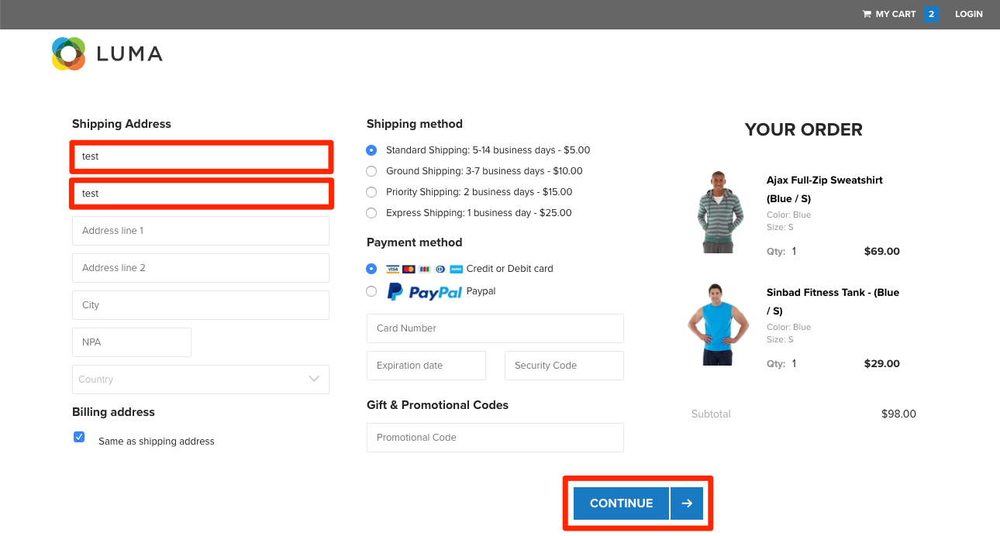

# Aggiungere Adobe Target

In questa lezione, implementeremo l’[estensione Adobe Target](https://experienceleague.adobe.com/docs/experience-platform/tags/extensions/adobe/target/overview.html?lang=it) con una richiesta di caricamento pagina e parametri personalizzati.

[Adobe Target](https://docs.adobe.com/content/help/it-IT/experience-cloud/user-guides/home.translate.html) è la soluzione di Adobe Experience Cloud che offre tutto il necessario per adattare e personalizzare l’esperienza dei clienti in modo da massimizzare i ricavi sui siti web e mobili, applicazioni, social media e altri canali digitali.


>[!WARNING]
>
> Il sito web Luma utilizzato in questa esercitazione dovrebbe essere sostituito durante la settimana del 16 febbraio 2026. Il lavoro svolto come parte di questo tutorial potrebbe non essere applicabile al nuovo sito web.

>[!NOTE]
>
>Adobe Experience Platform Launch viene integrato in Adobe Experience Platform come suite di tecnologie per la raccolta dati. Nell’interfaccia sono state introdotte diverse modifiche terminologiche di cui tenere conto quando si utilizza questo contenuto:
>
> * Platform Launch (lato client) è ora **[!DNL tags]**
> * Platform Launch Server Side è ora **[!DNL event forwarding]**
> * Le configurazioni di Edge sono ora **[!DNL datastreams]**

## Finalità di apprendimento

Alla fine di questa lezione, potrai:

* Aggiungi il frammento pre-hiding utilizzato per gestire lo sfarfallio quando utilizzi Target con codici di incorporamento di tag asincroni
* Aggiungere l’estensione Target v2
* Attivare la richiesta di caricamento pagina (precedentemente denominata &quot;mbox globale&quot;)
* Aggiungere parametri alla richiesta di caricamento pagina
* Spiegare in che modo i parametri di profilo ed entità possono essere aggiunti alla richiesta di caricamento pagina
* Attivare la richiesta di conferma dell’ordine con i parametri richiesti
* Spiegare come aggiungere configurazioni avanzate, ad esempio il codice Library Header e Library Footer
* Convalidare un’implementazione di Target

## Prerequisiti

Per completare le lezioni in questa sezione, devi prima completare le lezioni in [Configurare i tag](create-a-property.md) e [Aggiungere il servizio Identity](id-service.md).

## Aggiungere il frammento pre-hiding di Target

Prima di iniziare, è necessario aggiornare leggermente i codici di incorporamento dei tag. Quando i codici di incorporamento dei tag vengono caricati in modo asincrono, la pagina potrebbe terminare il rendering prima che la libreria di Target sia completamente caricata e abbia eseguito lo scambio di contenuto. Questo può causare il cosiddetto &quot;sfarfallio&quot;, in cui il contenuto predefinito viene visualizzato brevemente prima di essere sostituito dal contenuto personalizzato specificato da Target. Per evitare questo sfarfallio, consigliamo vivamente di codificare un frammento pre-hiding speciale immediatamente prima dei codici di incorporamento asincroni dei tag.

Questa operazione è già stata eseguita sul sito Luma, ma continuiamo a farlo sulla pagina di esempio in modo da riuscire a capire l’implementazione. Copia le seguenti righe di codice:

```html
<script>
   //prehiding snippet for Adobe Target with asynchronous tags deployment
   ;(function(win, doc, style, timeout) {
   var STYLE_ID = 'at-body-style';
   function getParent() {
      return doc.getElementsByTagName('head')[0];
   }
   function addStyle(parent, id, def) {
      if (!parent) {
      return;
      }
      var style = doc.createElement('style');
      style.id = id;
      style.innerHTML = def;
      parent.appendChild(style);
   }
   function removeStyle(parent, id) {
      if (!parent) {
      return;
      }
      var style = doc.getElementById(id);
      if (!style) {
      return;
      }
      parent.removeChild(style);
   }
   addStyle(getParent(), STYLE_ID, style);
   setTimeout(function() {
      removeStyle(getParent(), STYLE_ID);
   }, timeout);
   }(window, document, "body {opacity: 0 !important}", 3000));
</script>
```

Apri la pagina di esempio e incollala immediatamente prima del codice di incorporamento di tag come illustrato di seguito (non preoccuparti se i numeri di riga sono diversi). In questa schermata il frammento pre-hiding è stato ridotto al minimo:


Ricarica la pagina di esempio. La pagina verrà nascosta per tre secondi prima della visualizzazione. Questo comportamento è temporaneo e sparirà dopo la distribuzione di Target. Questo comportamento di pre-hiding è controllato da due configurazioni alla fine del frammento, che possono essere personalizzate, ma che generalmente è meglio lasciare con le impostazioni predefinite:

* `body {opacity: 0 !important}` specifica la definizione CSS da utilizzare per il pre-hiding fino al caricamento di Target. Per impostazione predefinita, l’intero corpo è nascosto. Se ad esempio disponi di una struttura DOM coerente con un elemento contenitore facilmente identificato che racchiude tutti i contenuti inclusi nella navigazione e non desideri testare o personalizzare la navigazione, potresti utilizzare questa impostazione per limitare il pre-hiding per quell’elemento contenitore.
* `3000` specifica l’impostazione di timeout per il pre-hiding. Per impostazione predefinita, se Target non viene caricato in tre secondi, la pagina verrà visualizzata. Questo dovrebbe accadere di rado.

Per ulteriori dettagli e per ottenere il frammento pre-hiding non minimizzato, consulta [l’estensione Adobe Target con implementazione asincrona &#x200B;](https://experienceleague.adobe.com/docs/experience-platform/tags/extensions/adobe/target/overview.html?lang=it#adobe-target-extension-with-an-asynchronous-deployment).

## Aggiungere l’estensione Target

L&#39;estensione Adobe Target supporta implementazioni lato client tramite la libreria JavaScript at.js di Target. Per le implementazioni Web SDK di Adobe Target, consulta l&#39;[Esercitazione Experience Platform Web SDK](https://experienceleague.adobe.com/it/docs/platform-learn/implement-web-sdk/applications-setup/setup-target).

L’estensione Target v2 consiste in due parti principali:

1. La configurazione dell’estensione, che gestisce le impostazioni della libreria principale
1. Azioni di regola per eseguire le operazioni seguenti:
   1. Caricare Target (at.js 2.x)
   1. Aggiungere parametri alle Richieste di caricamento pagina
   1. Aggiungere parametri a Tutte le richieste
   1. Attivare Richiesta di caricamento pagina

In questo primo esercizio aggiungeremo l’estensione ed esamineremo le configurazioni. Negli esercizi successivi utilizzeremo le azioni.

**Aggiungere l’estensione**

1. Vai a **[!UICONTROL Estensioni > Catalogo]**
1. Digita `target` nel filtro per individuare rapidamente le estensioni Adobe Target. Esistono due estensioni: Adobe Target e Adobe Target v2. Questa esercitazione utilizzerà la versione v2 dell’estensione che utilizza l’ultima versione di at.js (attualmente 2.x), ideale sia per i siti web tradizionali che per le applicazioni a pagina singola (SPA).
1. Fai clic su **[!UICONTROL Installa]**

   

1. Quando aggiungi l’estensione, verranno importate molte delle impostazioni at.js dall’interfaccia di Target, ma non tutte, come illustrato di seguito. Un’impostazione che non verrà importata è Timeout, che sarà sempre di 3000 ms dopo l’aggiunta dell’estensione. Per l’esercitazione, lascia le impostazioni predefinite. Tieni presente che a sinistra verrà mostrata la versione at.js fornita con la versione corrente dell’estensione.

1. Fai clic su **[!UICONTROL Salva nella libreria]**

   

A questo punto, Target non esegue realmente alcuna operazione, quindi non c’è nulla da convalidare.

>[!NOTE]
>
>Ogni versione dell’estensione Target viene fornita con una versione specifica di at.js, indicata nella descrizione dell’estensione. Aggiorna la versione at.js aggiornando l’estensione Target.

## Carica Target e attiva la Richiesta di caricamento pagina

Gli esperti di marketing utilizzano Target per controllare l’esperienza dei visitatori sulla pagina durante il test e il targeting del contenuto. A causa di questo ruolo importante nella visualizzazione della pagina, Target dovrebbe essere caricato il prima possibile per ridurre al minimo l’impatto sulla visibilità delle pagine. In questa sezione, verranno caricate la libreria JavaScript di Target, at.js, nonché la richiesta di caricamento pagina (detta &quot;mbox globale&quot; nelle versioni precedenti di at.js).

Puoi utilizzare la regola `All Pages - Library Loaded` creata nella lezione &quot;[Aggiungere elementi dati, regole e librerie](add-data-elements-rules.md)&quot; per implementare Target in quanto è già stata attivata il prima possibile sui caricamenti di pagina.

**Per caricare Target**

1. Vai a **[!UICONTROL Regole]** nel menu di navigazione a sinistra, quindi fai clic su `All Pages - Library Loaded` per aprire l&#39;editor di regole

   

1. In Azioni, fai clic su  per aggiungere una nuova azione.

   

1. Seleziona **[!UICONTROL Estensione > Adobe Target v2]**

1. Seleziona **[!UICONTROL Tipo azione > Carica Target]**

1. Fai clic su **[!UICONTROL Mantieni modifiche]**

   

Aggiungendo l’azione `Load Target`, at.js viene caricato sulla pagina. Tuttavia, nessuna richiesta Target verrà attivata finché non verrà aggiunta l’azione `Fire Page Load Request`.

**Per attivare la Richiesta di caricamento pagina**

1. In Azioni, fai nuovamente clic sull’icona  per aggiungere un’altra azione

   

1. Seleziona **[!UICONTROL Estensione > Adobe Target v2]**

1. Seleziona **[!UICONTROL Tipo azione > Attiva Richiesta di caricamento pagina]**

1. Sono disponibili alcune configurazioni per la richiesta di caricamento pagina collegate all’operazione di nascondere la pagina e il selettore CSS da utilizzare per il pre-hiding. Queste impostazioni funzionano insieme al frammento pre-hiding codificato nella pagina. Lascia le impostazioni predefinite.

1. Fai clic su **[!UICONTROL Mantieni modifiche]**

   

1. La nuova azione viene aggiunta in sequenza dopo l’azione `Load Target` e le azioni vengono eseguite in questo ordine. Puoi trascinare le azioni per riordinare l’ordine, ma in questo caso `Load Target` deve essere precedente a `Fire Page Load Request`.

1. Fai clic su **[!UICONTROL Salva nella libreria e genera]**

   

### Convalidare la richiesta di caricamento pagina

Dopo aver aggiunto l&#39;estensione Target v2 e aver avviato le azioni `Load Target` e `Fire Page Load Request`, è necessario eseguire una richiesta di caricamento pagina su tutte le pagine in cui viene utilizzata la proprietà tag.

**Per convalidare le azioni di Carica Target e Attiva Richiesta di caricamento pagina**

1. Ricarica la pagina di esempio. Non si verifica più un ritardo di tre secondi prima che la pagina sia visibile. Se stai caricando la pagina di esempio utilizzando il protocollo `file://`, devi effettuare questo passaggio in un browser Firefox o Safari perché Chrome non attiverebbe una richiesta Target quando viene utilizzato il protocollo `file://`.

1. Apri il [sito Luma](https://luma.enablementadobe.com/content/luma/us/en.html).

1. Accertati che Debugger mappi la proprietà tag nell&#39;ambiente di sviluppo *your*, come descritto nella [lezione precedente](switch-environments.md)

   

1. Vai alla scheda Riepilogo del debugger

1. Nella sezione `Launch`, conferma che `Target` venga visualizzato sotto l’intestazione `Extensions`

1. Nella sezione `Target`, verifica che venga visualizzata la versione della libreria at.js

   

1. Infine, vai alla scheda `Target`, espandi il codice client e conferma che venga visualizzata la richiesta di caricamento pagina:

   

Congratulazioni! Hai implementato Target!

## Aggiungere i parametri

Il passaggio dei parametri nella richiesta Target aggiunge funzionalità avanzate alle attività di targeting, test e personalizzazione. L’estensione tag fornisce due azioni per trasmettere i parametri:

1. `Add Params to Page Load Request`, che aggiunge parametri alle richieste di caricamento di pagina (equivalente al metodo [targetPageParams()](https://experienceleague.adobe.com/docs/target/using/implement-target/client-side/functions-overview/cmp-atjs-functions.html?lang=it))

1. `Add Params to All Requests`, che aggiunge parametri in tutte le richieste Target, ad esempio la richiesta di caricamento pagina più richieste aggiuntive effettuate da azioni del Codice personalizzato o di codifica fissa nel sito (equivalente al metodo [targetPageParamsAll()](https://experienceleague.adobe.com/docs/target/using/implement-target/client-side/functions-overview/cmp-atjs-functions.html?lang=it))

Queste azioni possono essere utilizzate *prima* dell’azione `Load Target` e possono impostare parametri diversi su pagine diverse in base alle configurazioni della regola. Utilizza la funzione di ordinamento delle regole utilizzata durante l’impostazione degli ID cliente con Identity Service per impostare parametri aggiuntivi sull’evento `Library Loaded` prima che la regola attivi la richiesta di caricamento pagina.
>[!TIP]
>
>Poiché la maggior parte delle implementazioni utilizza la richiesta di caricamento pagina per la distribuzione dell&#39;attività, in genere è sufficiente utilizzare l&#39;azione `Add Params to Page Load Requests`.

### Parametri di richiesta (mbox)

I parametri vengono utilizzati per trasmettere dati personalizzati a Target, arricchendo le capacità di personalizzazione. Sono ideali per gli attributi che cambiano frequentemente durante una sessione di navigazione come il nome della pagina, il modello, ecc. e che non persistono.

Aggiungiamo l’elemento dati `Page Name` creato in precedenza nella lezione [Aggiungere elementi dati, regole e librerie](add-data-elements-rules.md) come parametro della richiesta.

**Per aggiungere il parametro della richiesta**

1. Vai a **[!UICONTROL Regole]** nel menu di navigazione a sinistra, quindi fai clic su `All Pages - Library Loaded` per aprire l&#39;editor di regole.

   

1. In Azioni, fai clic su  per aggiungere una nuova azione.

   

1. Seleziona **[!UICONTROL Estensione > Adobe Target v2]**

1. Seleziona **[!UICONTROL Tipo azione > Aggiungi parametri alla Richiesta di caricamento pagina]**

1. Immetti `pageName` come **[!UICONTROL Nome]**

1. Fai clic sull’ per aprire l’elemento dati modale

1. Fai clic sull’elemento dati `Page Name`

1. Fai clic sul pulsante **[!UICONTROL Seleziona]**

   

1. Fai clic su **[!UICONTROL Mantieni modifiche]**

   

1. Fai clic e trascina sul bordo sinistro dell’azione `Add Params to Page Load Request` per ridisporre le azioni eseguite prima dell’azione `Fire Page Load Request` (prima o dopo `Load Target`)

1. Fai clic su **[!UICONTROL Salva nella libreria e genera]**

   

#### Convalidare i parametri della richiesta

Per il momento, i parametri personalizzati passati con le richieste at.js 2.x non sono facilmente visibili nel debugger, pertanto utilizzeremo gli strumenti di sviluppo del browser.

**Per convalidare il parametro della richiesta pageName**

1. Ricarica il sito Luma, verificando che sia mappato sulla tua proprietà tag
1. Apri gli strumenti per sviluppatori del browser
1. Fai clic sulla scheda Rete
1. Filtra le richieste in `tt.omtrdc` (o al dominio CNAME per le richieste Target)
1. Espandi la sezione `Headers` > `Request Payload` > `execute.pageLoad.parameters` per convalidare il parametro e il valore `pageName`


<!--Now go to the **[!UICONTROL Target]** tab in the Debugger. Expand your client code and look at the requests. You should see the new `pageName` parameter passed in the request:

-->

### Parametri del profilo

Analogamente ai parametri mbox, i parametri di profilo vengono trasmessi attraverso la richiesta Target. Tuttavia, i parametri di profilo vengono memorizzati nel database del profilo visitatore di Target e persistono per la [sua durata](https://experienceleague.adobe.com/docs/target/using/audiences/visitor-profiles/visitor-profile-lifetime.html?lang=it). Puoi impostarli su una pagina del sito e utilizzarli nelle attività di Target su un’altra pagina. Esempio da un sito web automobilistico. Quando un visitatore va sulla pagina di un veicolo, potresti trasmettere un parametro di profilo &quot;profile.lastViewed=sportscar&quot; per registrare il loro interesse in quel particolare veicolo. Quando il visitatore passa ad altre pagine non collegate a veicoli, puoi eseguire il targeting del contenuto in base all’ultimo veicolo visualizzato. I parametri di profilo sono ideali per le attribuzioni che raramente si modificano o sono disponibili solo su determinate pagine

Non trasmetterai alcun parametro di profilo in questa esercitazione, ma il flusso di lavoro è quasi identico a quello che si verifica quando trasmetti il parametro `pageName`. L’unica differenza consiste nel fatto che devi assegnare un prefisso `profile.` ai nomi del parametro di profilo. Questo è l’aspetto di un parametro di profilo denominato &quot;userType&quot; nell’azione `Add Params to Page Load Request`:


### Parametri entità

I parametri di entità sono parametri speciali utilizzati nelle [implementazioni della funzione Consigli](https://experienceleague.adobe.com/docs/target/using/recommendations/plan-implement.html?lang=it) per tre motivi principali:

1. Come chiave per attivare consigli sui prodotti. Ad esempio, quando si utilizza un algoritmo di consigli come “Chi ha visualizzato X, ha anche visualizzato Y”, “X” è la “chiave&quot; del consiglio. In genere è lo SKU del prodotto (`entity.id`) o la categoria (`entity.categoryId`) attualmente visualizzata dal visitatore.
1. Per raccogliere il comportamento dei visitatori e potenziare gli algoritmi per la generazione di consigli, ad esempio “Prodotti visualizzati di recente” o “Prodotti più visualizzati”
1. Compilazione del catalogo Consigli. La funzione Consigli contiene un database di tutti i prodotti o articoli sul sito web, in modo che possano essere trasmessi nell’offerta di consigli. Ad esempio, durante la raccomandazione dei prodotti, in genere si desiderano visualizzare attributi come il nome del prodotto (`entity.name`) e l’immagine (`entity.thumbnailUrl`). Alcuni clienti compilano il catalogo utilizzando i feed di backend, ma possono anche essere compilati utilizzando i parametri delle entità nelle richieste Target.

Non è necessario trasmettere parametri di entità in questa esercitazione, ma il flusso di lavoro è identico a quello eseguito in precedenza al momento del passaggio del parametro della richiesta `pageName`; assegna al parametro un nome con il prefisso &quot;entity.&quot; e mappalo sull’elemento dati pertinente. Tieni presente che alcune entità comuni presentano nomi riservati che devono essere utilizzati (ad esempio, entity.id per lo SKU del prodotto). Per impostare i parametri delle entità nell’azione `Add Params to Page Load Request`:


### Aggiungere parametri ID cliente

La raccolta di ID cliente con Adobe Experience Platform Identity Service semplifica l’importazione di dati CRM in Target tramite la funzione [Attributi cliente](https://experienceleague.adobe.com/docs/target/using/audiences/visitor-profiles/working-with-customer-attributes.html?lang=it) di Adobe Experience Cloud. Abilita inoltre [la combinazione di visitatori su più dispositivi](https://experienceleague.adobe.com/docs/target/using/integrate/experience-cloud-device-co-op.html?lang=it), per mantenere un’esperienza utente coerente quando i clienti passano da un laptop a un dispositivo mobile.

È fondamentale impostare l’ID cliente nell’azione `Set Customer IDs` di Identity Service prima di attivare la richiesta di caricamento pagina. A tale fine, assicurati di disporre delle seguenti funzionalità sul sito:

* L’ID cliente deve essere disponibile sulla pagina prima del codice di incorporamento dei tag
* L’estensione di Adobe Experience Platform Identity Service deve essere installata
* Devi utilizzare l’azione `Set Customer IDs` in una regola che viene attivata all’evento “Library Loaded (Page Top)” (Libreria caricata (Inizio pagina))
* Utilizza l’azione `Fire Page Load Request` in una regola che viene attivata *dopo* l’azione &quot;Imposta ID cliente&quot;

Nella lezione precedente, [Aggiungere Adobe Experience Platform Identity Service](id-service.md), hai creato la regola `All Pages - Library Loaded - Authenticated - 10` per attivare l’azione “Imposta ID cliente”. Poiché questa regola presenta un’impostazione `Order` di `10`, gli ID cliente vengono impostati prima che la nostra richiesta di caricamento pagina venga attivata dalla regola `All Pages - Library Loaded` con l’impostazione `Order` di `50`. Pertanto, hai già implementato la raccolta degli ID cliente per Target!

#### Convalidare l’ID cliente

Per il momento, i parametri personalizzati passati con le richieste at.js 2.x non sono facilmente visibili nel debugger, pertanto utilizzeremo gli strumenti di sviluppo del browser.

**Per convalidare l’ID cliente**

1. Apri il [sito Luma](https://luma.enablementadobe.com/content/luma/us/en.html).

1. Accertati che Debugger mappi la proprietà tag nell&#39;ambiente di sviluppo *your*, come descritto nella [lezione precedente](switch-environments.md)

   

1. Accedi al sito Luma utilizzando le credenziali `test@test.com`/`test`
1. Torna alla [home page di Luma](https://luma.enablementadobe.com/content/luma/us/en.html)

1. Apri gli strumenti per sviluppatori del browser
1. Fai clic sulla scheda Rete
1. Filtra le richieste in `tt.omtrdc` (o al dominio CNAME per le richieste Target)
1. Espandi la sezione `Headers` > `Request Payload` > `id.customerIds.0` per convalidare le impostazioni e il valore dell’ID cliente:


<!--
1. Open the Debugger
1. Go to the Target tab
1. Expand your client code
1. You should see parameters in the latest Target request for `vst.crm_id.id` and `vst.crm_id.authState`. `vst.crm_id.id` should have a value of the hashed email address and `vst.crm_id.authState` should have a value of `1` to represent `authenticated`. Note that `crm_id` is the `Integration Code` you specified in the Identity Service configuration and must align with the key you use in your [Customer Attributes data file](https://experienceleague.adobe.com/docs/core-services/interface/customer-attributes/t-crs-usecase.html?lang=it):


-->

>[!WARNING]
>
>Il servizio Adobe Experience Platform Identity consente di inviare più ID al servizio. Tuttavia, solo il primo verrà inviato a Target.

### Aggiungere il parametro Token di proprietà

>[!NOTE]
>
>Questo è un esercizio facoltativo per i clienti Target Premium.

Il token di proprietà è un parametro riservato utilizzato con la funzione [Autorizzazioni utente Target Premium Enterprise](https://experienceleague.adobe.com/docs/target/using/administer/manage-users/enterprise/property-channel.html?lang=it). Viene utilizzato per definire proprietà digitali diverse, in modo che ai diversi membri di un’organizzazione Experience Cloud possano essere assegnate autorizzazioni diverse a ciascuna proprietà. Ad esempio, potresti desiderare che un gruppo di utenti sia in grado di configurare le attività Target sul tuo sito web, ma non nell’applicazione mobile.

Le proprietà di Target sono simili alle proprietà dei tag e alle suite di rapporti di Analytics. Un’azienda con più marchi, siti web e team di marketing può utilizzare una proprietà Target diversa, una proprietà tag e una suite di rapporti Analytics per ogni sito web o app mobile. Le proprietà dei tag sono differenziate dai rispettivi codici di incorporamento, le suite di rapporti di Analytics sono differenziate dalla relativa suite di rapporti ID e le proprietà Target sono differenziate dal parametro token di proprietà.


Il token di proprietà deve essere implementato utilizzando un&#39;azione di codice personalizzato nei tag con la funzione `targetPageParams()`. Se implementi più siti con diversi utilizzando valori at_property diversi con una singola proprietà tag, puoi gestire il valore at_property tramite un elemento dati.

Questo è un esercizio facoltativo, se sei un cliente Target Premium e desideri implementare un token di proprietà nella proprietà Esercitazione:

1. In una scheda separata, apri l’interfaccia utente di Target

1. Vai a **[!UICONTROL Amministrazione > Proprietà]**

1. Identificare la proprietà che si desidera utilizzare e fare clic su **[!UICONTROL &lt;/>]** (o creare una nuova proprietà)

1. Copia il frammento di codice all&#39;interno di `<script></script>` negli Appunti

   

1. Nella scheda Tag, vai a **[!UICONTROL Regole]** nel menu di navigazione a sinistra, quindi fai clic su `All Pages - Library Loaded` per aprire l&#39;editor di regole.

   

1. In Azioni, fai clic sull’azione `Core - Custom Code` per aprire la `Action Configuration`

   

1. Aprire l&#39;editor di codice e incollare il codice dall&#39;interfaccia di Target contenente la funzione `targetPageParams()`
1. Fai clic sul pulsante **[!UICONTROL Salva]**

   

1. Seleziona la casella **[!UICONTROL Esegui globalmente]** in modo che `targetPageParams()` sia dichiarato nell&#39;ambito globale
1. Fai clic su **[!UICONTROL Mantieni modifiche]**

   

1. Fai clic su **[!UICONTROL Salva nella libreria e genera]**
   

>[!WARNING]
>
>Se si tenta di aggiungere il parametro `at_property` tramite l&#39;azione **[!UICONTROL Aggiungi parametri alla richiesta di caricamento pagina]**, il parametro verrà popolato nella richiesta di rete ma il Compositore esperienza visivo di Target non sarà in grado di rilevarlo automaticamente durante il caricamento della pagina. Compila sempre `at_property` utilizzando la funzione `targetPageParams()` in un&#39;azione Codice personalizzato.

#### Convalida il Token di proprietà

Per il momento, i parametri personalizzati passati con le richieste at.js 2.x non sono facilmente visibili nel debugger, pertanto utilizzeremo gli strumenti di sviluppo del browser.

**Per convalidare il parametro Token di proprietà**

1. Apri il [sito Luma](https://luma.enablementadobe.com/content/luma/us/en.html).
1. Accertati che Debugger mappi la proprietà tag nell&#39;ambiente di sviluppo *your*, come descritto nella [lezione precedente](switch-environments.md)

   

1. Apri gli strumenti per sviluppatori del browser
1. Fai clic sulla scheda Rete
1. Filtra le richieste in `tt.omtrdc` (o al dominio CNAME per le richieste Target)
1. Espandi la sezione `Headers` > `Request Payload` > `property.token` per convalidare il valore
   

<!--
1. Go to the `Target` tab
1. Expand your client code
1. You should see the parameter for "at_property" in every page load request request as you browse the site:

-->

## Aggiungere richieste personalizzate

### Aggiungere una richiesta di conferma dell’ordine

La richiesta di conferma dell’ordine è un tipo speciale di richiesta utilizzata per inviare i dettagli dell’ordine a Target. L’inclusione di tre parametri di richiesta specifici: orderId, orderTotal e productPurchasedId, è ciò che trasforma una richiesta Target regolare in una richiesta di ordine. Oltre alle entrate di reporting, la richiesta dell’ordine esegue anche le seguenti operazioni:

1. Deduplica gli ordini reinviati per errore
1. Filtra ordini estremi (qualsiasi ordine il cui totale era costituito da più di tre deviazioni standard dalla media)
1. Utilizza un algoritmo diverso per calcolare la confidenza statistica
1. Crea un rapporto Audit speciale scaricabile dei singoli dettagli dell&#39;ordine

La best practice prevede l’utilizzo di una richiesta di conferma dell’ordine in tutti i funnel, anche sui siti non destinati alla vendita. Ad esempio, i siti di generazione di lead hanno in genere funnel lead con un &quot;ID lead&quot; univoco generato alla fine. Questi siti devono implementare una richiesta dell’ordine utilizzando un valore statico (ad esempio 1) per orderTotal.

I clienti che utilizzano l’integrazione Analytics for Target (A4T) per la maggior parte dei rapporti possono anche implementare la richiesta dell’ordine se utilizzano attività di Automated Personalization che non supportano A4T. Inoltre, la richiesta dell’ordine è un elemento critico nelle implementazioni di Recommendations, che potenzia gli algoritmi in base al comportamento d’acquisto. Per informazioni aggiornate sul supporto A4T, consulta [la documentazione](https://experienceleague.adobe.com/docs/target/using/integrate/a4t/a4t.html?lang=it#section_F487896214BF4803AF78C552EF1669AA).

La richiesta di conferma dell’ordine dovrebbe attivarsi da una regola attivata solo nella pagina o nell’evento di conferma dell’ordine. Spesso può essere combinato con una regola che imposta l’evento di acquisto di Adobe Analytics. Deve essere configurato utilizzando l’azione Codice personalizzato dell’estensione Core, utilizzando gli elementi dati appropriati per impostare i parametri orderId, orderTotal e productPurchasedId.

Aggiungiamo gli elementi dati e la regola di cui abbiamo bisogno per attivare una richiesta di conferma dell’ordine sul sito Luma. Poiché hai già creato diversi elementi dati, queste istruzioni vengono abbreviate.

**Per creare l’elemento dati per l’ID ordine**

1. Fai clic su **[!UICONTROL Elementi dati]** nel menu di navigazione a sinistra
1. Fai clic su **[!UICONTROL Aggiungi elemento dati]**
1. Denomina l’elemento dati `Order Id`
1. Seleziona **[!UICONTROL Tipo elemento dati > Variabile JavaScript]**
1. Usa `digitalData.cart.orderId` come `JavaScript variable name`
1. Controlla l’opzione `Clean text`
1. Fai clic su **[!UICONTROL Salva nella libreria]**
(La libreria non verrà creata finché non verranno apportate tutte le modifiche per la richiesta di conferma dell’ordine)

**Per creare l’elemento dati per l’Importo del carrello**

1. Fai clic su **[!UICONTROL Aggiungi elemento dati]**
1. Denomina l’elemento dati `Cart Amount`
1. Seleziona **[!UICONTROL Tipo elemento dati > Variabile JavaScript]**
1. Usa `digitalData.cart.cartAmount` come `JavaScript variable name`
1. Controlla l’opzione `Clean text`
1. Fai clic su **[!UICONTROL Salva nella libreria]**

**Per creare l’elemento dati per SKU carrello (Target)**

1. Fai clic su **[!UICONTROL Aggiungi elemento dati]**
1. Denomina l’elemento dati `Cart SKUs (Target)`
1. Seleziona **[!UICONTROL Tipo elemento dati > Codice personalizzato]**
1. Per Target, gli sku devono essere un elenco separato da virgole. Questo codice personalizzato riformatterà l’array di livello dati nel formato corretto. Nell’editor di codice personalizzato, incolla quanto segue:

   ```javascript
   var targetProdSkus="";
   for (var i=0; i<digitalData.cart.cartEntries.length; i++) {
     if(i>0) {
       targetProdSkus = targetProdSkus + ",";
     }
     targetProdSkus = targetProdSkus + digitalData.cart.cartEntries[i].sku;
   }
   return targetProdSkus;
   ```

1. Controlla l’opzione `Force lowercase value`
1. Controlla l’opzione `Clean text`
1. Fai clic su **[!UICONTROL Salva nella libreria]**

Ora è necessario creare una regola per attivare la richiesta di conferma dell’ordine con questi elementi dati come parametri nella pagina di conferma dell’ordine.

**Per creare la regola per la pagina Conferma ordine**

1. Fai clic su **[!UICONTROL Regole]** nel menu di navigazione a sinistra
1. Fai clic su **[!UICONTROL Aggiungi regola]**
1. Denomina la regola `Order Confirmation Page - Library Loaded - 60`
1. Fai clic su **[!UICONTROL Eventi > Aggiungi]**
   1. Seleziona **[!UICONTROL Tipo evento > Libreria caricata (Pagina in alto)]**
   1. In **[!UICONTROL Opzioni avanzate]**, modifica `Order` in `60` in modo che venga attivato dopo l&#39;azione `Load Target` (che si trova nella regola `All Pages - Library Loaded` in cui `Order` è impostato su `50`)
   1. Fai clic su **[!UICONTROL Mantieni modifiche]**
1. Fai clic su **[!UICONTROL Condizioni > Aggiungi]**
   1. Seleziona **[!UICONTROL Tipo condizione > Percorso senza stringa di query]**
   1. Per `Path equals` immetti `thank-you.html`
   1. Attiva l’opzione Regex per cambiare la logica da `equals` a `contains` (puoi usare la funzione `Test` per confermare che il test passerà con l’URL `https://luma.enablementadobe.com/content/luma/us/en/user/checkout/order/thank-you.html`

      

   1. Fai clic su **[!UICONTROL Mantieni modifiche]**
1. Fai clic su **[!UICONTROL Azioni > Aggiungi]**
   1. Seleziona **[!UICONTROL Tipo azione > Codice personalizzato]**
   1. Fai clic su **[!UICONTROL Apri editor]**
   1. Incolla il seguente codice nel modale `Edit Code`

      ```javascript
      adobe.target.getOffer({
        "mbox": "orderConfirmPage",
        "params":{
           "orderId": _satellite.getVar('Order Id'),
           "orderTotal": _satellite.getVar('Cart Amount'),
          "productPurchasedId": _satellite.getVar('Cart SKUs (Target)')
        },
        "success": function(offer) {
          adobe.target.applyOffer({
            "mbox": "orderConfirmPage",
            "offer": offer
          });
        },
        "error": function(status, error) {
          console.log('Error', status, error);
        }
      });
      ```

   1. Fai clic su **[!UICONTROL Salva]** per salvare il codice personalizzato
   1. Fai clic su **[!UICONTROL Mantieni modifiche]** per mantenere l&#39;azione
1. Fai clic su **[!UICONTROL Salva nella libreria e genera]**

#### Convalida la richiesta di conferma dell’ordine

Per il momento, i parametri personalizzati passati con le richieste at.js 2.x non sono facilmente visibili nel debugger, pertanto utilizzeremo gli strumenti di sviluppo del browser.

1. Apri il [sito Luma](https://luma.enablementadobe.com/content/luma/us/en.html).

1. Accertati che Debugger mappi la proprietà tag nell&#39;ambiente di sviluppo *your*, come descritto nella [lezione precedente](switch-environments.md)

   

1. Sfoglia il sito e aggiungi più prodotti al carrello
1. Procedi con il pagamento
1. Durante il processo di pagamento gli unici campi obbligatori sono `First Name` e `Last Name`

   

1. Sulla pagina Rivedi ordine, assicurati di fare clic sul pulsante `Place Order`
1. Apri gli strumenti per sviluppatori del browser
1. Fai clic sulla scheda Rete
1. Filtra le richieste in `tt.omtrdc` (o al dominio CNAME per le richieste Target)
1. Fai clic sulla seconda richiesta
1. Espandi la sezione `Headers` > `Request Payload` > `execute.mboxes.0` per convalidare il nome della richiesta e i parametri dell’ordine:


<!--
1. Look in the Debugger
1. Go to the Target tab
1. Expand your client code
1. You should see the `orderConfirmPage` request as the latest Target request with the orderId, orderTotal, and productPurchasedId parameters populated with the details of your order

   link to "orderConfirmPage request with required parameters": images/target-debugger-orderConfirmPage.png 
-->

### Richieste personalizzate

Esistono alcune rare istanze in cui devi effettuare richieste Target diverse dalla richiesta di caricamento pagina e di conferma dell’ordine. Ad esempio, a volte i dati importanti che desideri utilizzare per la personalizzazione non vengono definiti sulla pagina prima dei codici di incorporamento dei tag; potrebbero essere codificati in modo fisso nella parte inferiore della pagina o restituiti da una richiesta API asincrona. Questi dati possono essere inviati a Target utilizzando una richiesta aggiuntiva, anche se non sarebbe ottimale utilizzare questa richiesta per la distribuzione di contenuto, in quanto la pagina è già visibile. Questi dati possono essere utilizzati per arricchire il profilo visitatore per un uso successivo (utilizzando i parametri di profilo) o per popolare il catalogo Consigli.

In queste circostanze, utilizza l&#39;azione Codice personalizzato nell&#39;estensione Core per attivare una richiesta utilizzando i metodi [getOffer()](https://experienceleague.adobe.com/docs/target-dev/developer/client-side/at-js-implementation/functions-overview/adobe-target-getoffer.html?lang=it)/[applyOffer()](https://experienceleague.adobe.com/docs/target-dev/developer/client-side/at-js-implementation/functions-overview/adobe-target-applyoffer.html?lang=it) e [trackEvent()](https://experienceleague.adobe.com/docs/target-dev/developer/client-side/at-js-implementation/functions-overview/adobe-target-trackevent.html?lang=it). Si tratta di un processo simile a quello dell&#39;esercizio [Richiesta di conferma dell&#39;ordine](#order-confirmation-request), ma verrà utilizzato un nome di richiesta diverso e non i parametri dell&#39;ordine speciali. Assicurati di utilizzare l&#39;azione **[!UICONTROL Carica Target]** prima di effettuare richieste Target dal codice personalizzato.

## Library Header e Library Footer

La schermata Edit at.js nell’interfaccia utente di Target dispone delle posizioni in cui puoi incollare JavaScript personalizzato che viene eseguito immediatamente prima o dopo il file at.js. Talvolta, il Library Header viene utilizzato per sostituire le impostazioni at.js tramite la funzione [targetGlobalSettings()](https://experienceleague.adobe.com/docs/target/using/implement-target/client-side/functions-overview/targetgobalsettings.html?lang=it) o per trasmettere dati da terze parti tramite la funzione [Data Provider](https://experienceleague.adobe.com/docs/target-learn/tutorials/integrations/use-data-providers-to-integrate-third-party-data.html?lang=it). A volte, il Library Footer viene utilizzato per aggiungere listener di [eventi personalizzati at.js](https://experienceleague.adobe.com/docs/target-dev/developer/client-side/at-js-implementation/functions-overview/atjs-custom-events.html?lang=it).

Per replicare questa funzionalità nei tag, utilizza l’azione Custom Code nell’estensione Core e metti in sequenza l’azione prima (Library Header) o dopo (Library Footer) l’azione Load Target. Questa operazione può essere eseguita nella stessa regola dell’azione `Load Target` (come illustrato di seguito) oppure in regole separate con eventi o impostazioni d’ordine che in modo affidabile si attivino prima o dopo la regola che contiene `Load Target`:


Per ulteriori informazioni su casi di utilizzo per intestazioni e piè di pagina personalizzati, consulta le risorse seguenti:

* [Utilizza dataProvider per integrare dati di terze parti in Adobe Target](https://experienceleague.adobe.com/docs/target-learn/tutorials/integrations/use-data-providers-to-integrate-third-party-data.html?lang=it)
* [Implementa dataProvider per integrare dati di terze parti in Adobe Target](https://experienceleague.adobe.com/docs/target-learn/tutorials/integrations/implement-data-providers-to-integrate-third-party-data.html?lang=it)
* [Utilizza i token di risposta e gli eventi personalizzati at.js con Adobe Target](https://experienceleague.adobe.com/docs/target-learn/tutorials/integrations/use-response-tokens-and-atjs-custom-events.html?lang=it)

[Avanti &quot;Aggiungere Adobe Analytics&quot; >](analytics.md)
